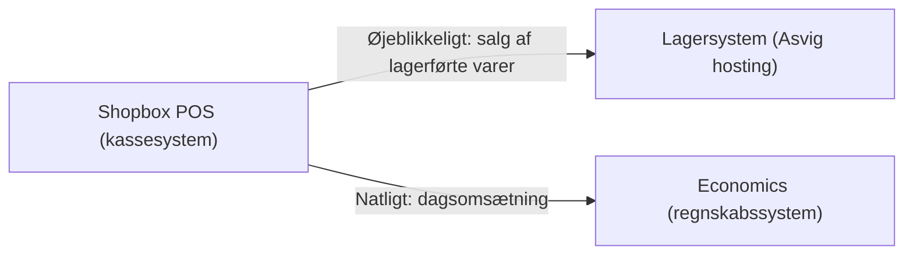
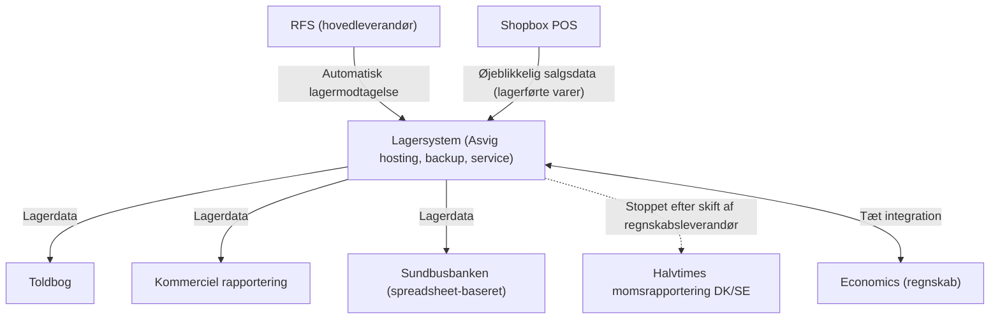
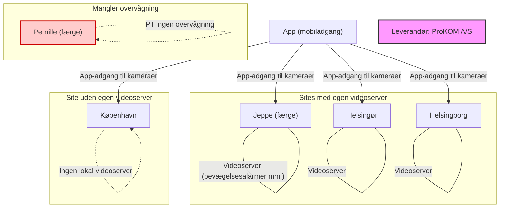

# Dokumentation af IT-infrastruktur – Sundbusserne

**Dato:** Maj 2026  
**Formål:** Overblik over infrastruktur, kritiske systemer og leverandørforhold

---

## 1. Indledning

Sundbussernes IT-infrastruktur består af en række systemer, der enten er lovpligtige, kritiske for driften eller nødvendige for at et relativt lille antal medarbejdere kan opretholde overblikket. Dette dokument giver en samlet oversigt over systemer, integrationer, leverandører samt kendte udfordringer og fremtidige prioriteter.

---

## 2. Hovedsystemer og leverandører

### 2.1 Shopbox – POS-system (kasseapparater)

- **Funktion:** Håndterer salg i land og på skibe. Alle varesalg overføres øjeblikkeligt til lagersystemet. Dagsomsætning samles og overføres natligt til Economics.
- **Leverandør:** Shopbox.dk

**Shopbox POS** sender **øjeblikkeligt** data om solgte lagerførte varer til **Lagersystemet**, så lagertal altid er opdaterede i realtid. **Shopbox POS** sender hver nat den samlede **dagsomsætning** til **Economics** (regnskabssystemet).

### 2.2 Lagersystem (told- og frivarer)

- **Funktion:** Samlet lagerstyring for land og skibe. Tæt integreret med Shopbox og Economics. Understøtter automatisk lagermodtagelse fra RFS (hovedleverandør). Leverer data til Toldbog, kommerciel rapportering og “Sundbusbanken” (spreadsheet-baseret). Indeholder også halvtimesrapportering til momsfordeling DK/SE – denne funktion ser ud til at være ophørt efter skift af regnskabsleverandør.
- **Leverandør:** Asvig (hosting, backup, service)

**Forklaring til diagrammet:**

- **Indgående data**: RFS sender automatisk lagermodtagelse (varer). Shopbox sender salg af lagerførte varer i realtid.
- **Udgående data**: Lagersystemet leverer data til Toldbog, kommerciel rapportering og Sundbusbanken (spreadsheet).
- **Stoppet funktion**: Halvtimes momsrapportering var tidligere en funktion, men er ophørt (vist med stiplet pil).
- **Integration**: Tæt integration med Economics (gensidig dataudveksling).

### 2.3 Billetsystem (inkl. billetautomat og webshop)

- **Funktion:** Sammenhængende billetsystem med salg i lokalvaluta (Helsingør/Helsingborg). Webshop (book.sundbussenre.dk) deler billetmodel og validering med automaterne. Betalinger samles via ePay (kommercielt) og Softpay.
- **Leverandør:** Asvig (hosting, backup, administration)

### 2.4 Economics – Regnskabssystem

- **Funktion:** Modtager daglig omsætning fra POS-kasser, websalg, billetsalg m.v. via udviklede integrationsfunktioner.
- **Leverandør:** Ikke specifikt nævnt (systemet anvendes internt)

### 2.5 Toldbøger / lagerkontrol (data)

- **Funktion:** Avancerede regneark udviklet af HFR. Data leveres fra Shopbox og lagersystemet.
- **Leverandør/udvikler:** HFR

### 2.6 ISM / ISPS – Systemer

- **Funktion:** Udviklet til styring af sikkerhed og drift i henhold til ISM/ISPS-krav. Hostet i Microsoft 365. Implementeringen er langt fremme, men der mangler stadig områder.
- **Leverandør:** Honnimar

### 2.7 Videoovervågning (ISPS)

- **Funktion:** Samlet overvågning med app-adgang til kameraer. PT ingen overvågning på færgen *Pernille*. Der er behov for udvidelse flere steder. Videoovervågningen er installaleret på *Jeppe*, *Helsingør* og *Helsingborg* samt *København*, alle sites har egen videoserver (undtagen KBH), som kan konfigureres mht. bevægelsesalarmer osv.
- **Leverandør:** ProKOM A/S

**Forklaring:**

- **Grønne områder:** *Jeppe*, *Helsingør*, *Helsingborg* har hver deres videoserver (understøtter bevægelsesalarmer mv.)
- **Blå område:** *København* har kameraer, men ingen lokal videoserver
- **Rød markering:** *Pernille* har ingen overvågning i dag
- **App-adgang** til alle sites (undtagen Pernille)
- **Leverandør:** ProKOM A/S

*Yderligere udvidelser er nødvendige flere steder ifølge dokumentationen.*

### 2.8 MiWire – Kommunikation til/fra skibe

- **Funktion:** Dataforbindelse til skibene. Delvist udviklingsprojekt med tæt samarbejde mellem MiWire og Sundbusserne. Komponenter er til dels forældede. Stabiliteten er svingende.
- **Anbefaling:** Opgradering eller overvejelse af satellitløsning til *Jeppe* og *Pernille*.
- **Leverandør:** MiWire (Lyngby)

### 2.9 Infrastruktur på land og skibe

- **Status:** Projekt startet på *Jeppe* i 2026 (Wi-Fi færdiggjort). Helsingør påbegyndt, men ikke fuldendt. Formålet er at øge stabilitet og opdatere ældre infrastruktur.
- **Leverandør:** Ikke specificeret (internt projekt)

### 2.10 Sharepoint, filer, e-mails

- **Funktion:** Office365-miljø til samarbejde og kommunikation.
- **Leverandør:** Microsoft (håndteret af Asvig)

### 2.11 Backup af data

- **Dækker:** Alle systemer.
- **Leverandør:** Asvig (hosting og håndtering)

### 2.12 Domenavne og websider

- **Status:** Splittet mellem flere leverandører.
- **Leverandører:** Asvig, Thorn, muligvis One.com

---

## 3. Leverandører – samlet overblik

| Leverandør | Ansvarsområde(r) |
|------------|------------------|
| **Shopbox.dk** | POS-system (kasseapparater) |
| **Asvig** | Lagersystem, billetsystem, hosting/backup af data, Office365-administration, dele af domæner |
| **RFS** | Hovedleverandør af varer (automatisk lagermodtagelse) |
| **ePay** | Betalingsformidling for billetsystem |
| **Softpay** | Betalingsformidling for billetsystem |
| **HFR** | Udvikling af toldbogs-regneark |
| **Honnimar** | ISM/ISPS-systemer (hostet i Microsoft 365) |
| **MiWire** | Kommunikation til/fra skibe |
| **Microsoft** | Office365 (Sharepoint, e-mails, filer) |
| **Thorn** | Webside (www.sundbusserne.dk), domæner |
| **ProKOM** | Overvågning etc. |
| **One.com** | Muligvis dele af domæner |

---

## 4. Kendte udfordringer og risici

- **Momsrapportering (halvtimes)**: Stoppet efter skift af regnskabsleverandør – bør afklares.
- **Videoovervågning**: Ingen overvågning på *Pernille*. Udvidelse nødvendig flere steder.
- **MiWire**: Aldrende komponenter, svingende stabilitet. Fremtid bør afklares (opgradering eller satellit).
- **Infrastruktur i Helsingør/Helsingborg**: Daglige udfordringer for personale. Både 5G-forbindelser er ustabile.
- **Domæner**: Splittet mellem flere leverandører – risiko for manglende overblik og kontrol.

---

## 5. Fremtidige prioriteter

Afhængigt af rederiets strategi bør følgende prioriteres:

1. **Færdiggørelse af infrastruktur i Helsingør** – giver daglige driftsudfordringer.
2. **Stabilisering af internetforbindelser i Helsingør og Helsingborg** (nu 5G, ikke pålideligt).
3. **Afklaring af MiWire-fremtid** – opgradering eller skift til satellit for *Jeppe* og *Pernille*.
4. **Samling af domæneadministration** hos én leverandør.
5. **Genoprettelse af halvtimes-momsrapportering** eller alternativ løsning.
6. **Udvidelse af videoovervågning** til at dække *Pernille* og øvrige kritiske områder.

---

*Dokumentet er udarbejdet på baggrund af den foreliggende infrastrukturbeskrivelse pr. maj 2026.*

