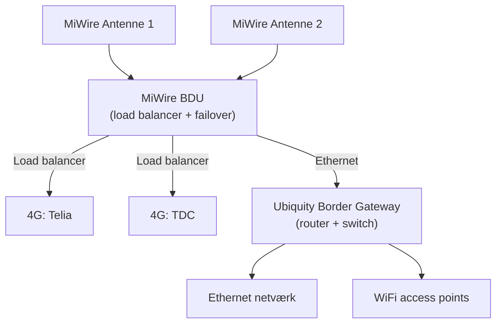
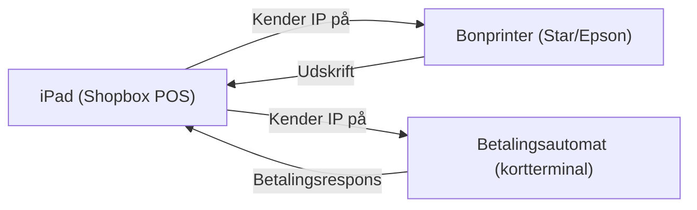
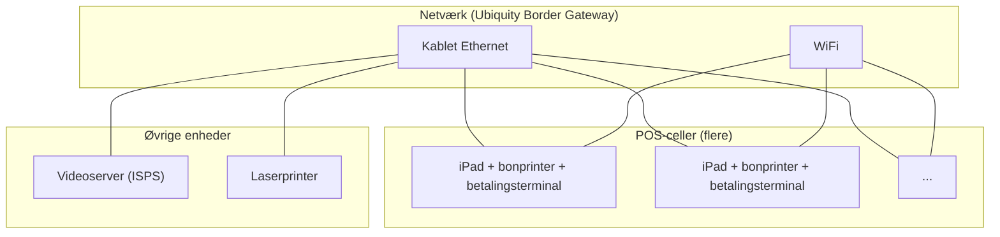

Her er en omskrivning til et **executive overview** med teknisk dybde samt Mermaid-diagrammer, der illustrerer infrastrukturen om bord på *Jeppe*.

---

## Executive Overview: Infrastruktur på M/S Jeppe

### Netværks- & connectivitylag

Infrastrukturen på *Jeppe* er designet med redundant internetforbindelse via **to uafhængige MiWire-antennesystemer**. Disse fødes ind i en **MiWire BDU (Below Deck Unit)**, som varetager:
- **Load balancing** mellem to 4G-operatorer (Telia og TDC)
- **Automatisk failover** ved tab af forbindelse på én operator

BDU’ens Ethernet-udgang er koblet direkte til en **Ubiquity Border Gateway**, der fungerer som central router og switch. Den håndterer både kablet Ethernet og WiFi access points om bord.

### 1. Overordnet netværksarkitektur

### POS- & betalingsinfrastruktur

Hver kassestation (celle) består af:
- **iPad** med Shopbox POS-klient
- **Bonprinter** (Star eller Epson)
- **Betalingsautomat** (kortterminal)

Disse tre enheder er konfigureret i et lokalt IP-netværk, hvor Shopbox-terminalen kender bonprinterens og betalingsautomatens IP-adresser. Kommunikationen mellem dem er direkte (peer-to-peer inden for cellen).

### 2. Kassestation (POS-celle) – typisk opsætning

### Øvrige systemer om bord

- **Videoserver** (ISPS-kameraovervågning) tilsluttet det kablede netværk
- **Laserprinter** til kontorfunktioner (f.eks. udskrifter af toldrapporter eller lister)

### Samlet vurdering

Infrastrukturen på *Jeppe* er robust med hensyn til internetredundans (dual 4G + load balancing/failover). Kassestationerne er decentrale og uafhængige, hvilket giver høj fejltolerance. Den samlede arkitektur er overskuelig og vedligeholdes via Ubiquity-enheden, som tillader central netværksmonitorering.

### 3. Samlet enhedsoversigt på Jeppe

