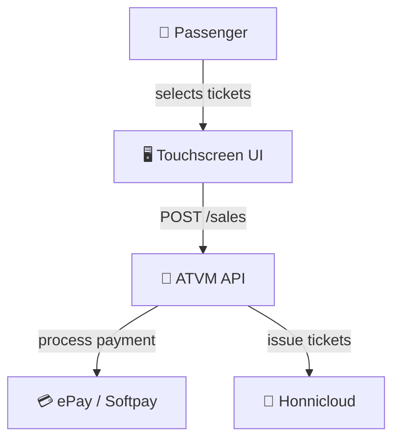
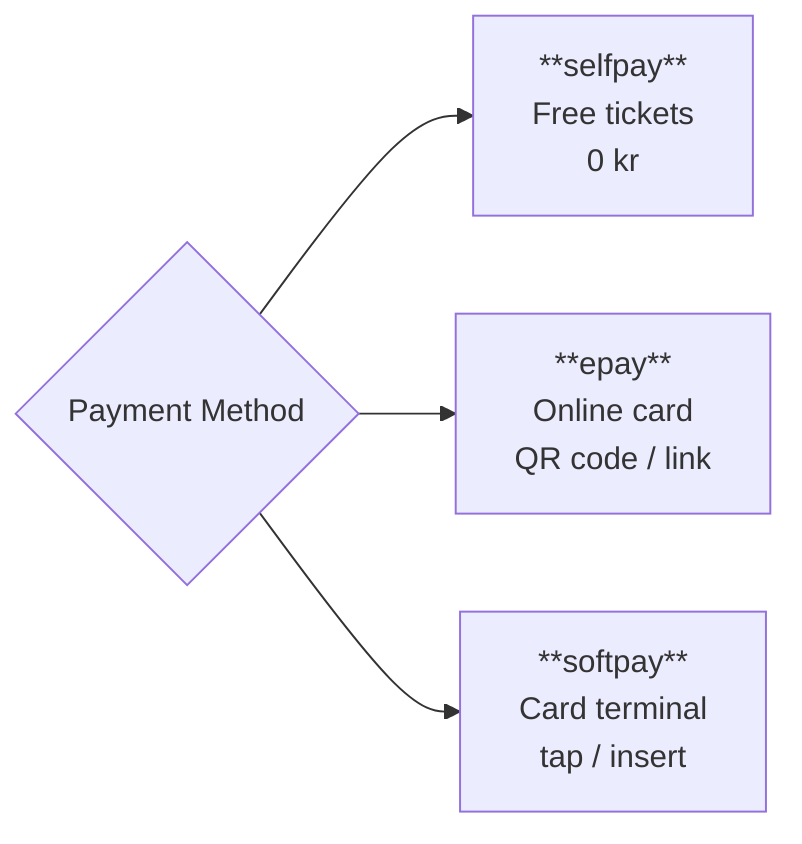
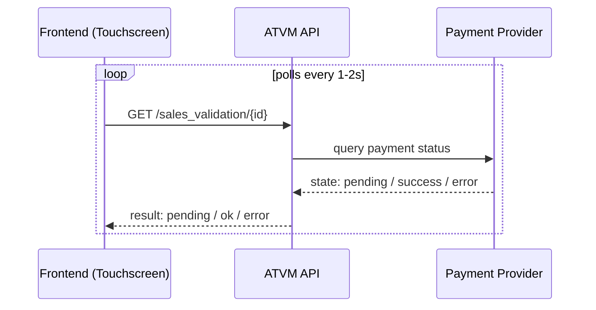
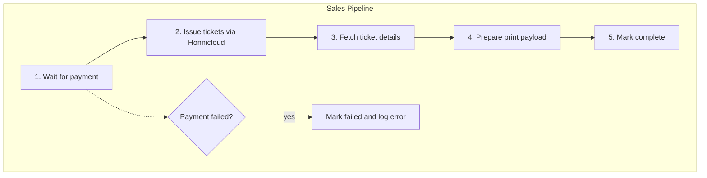
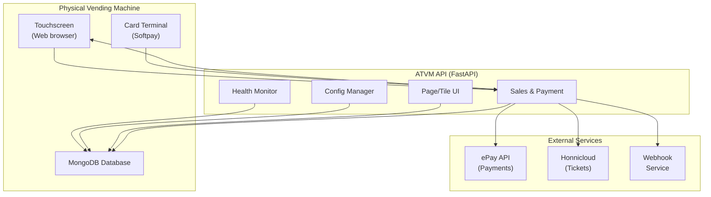
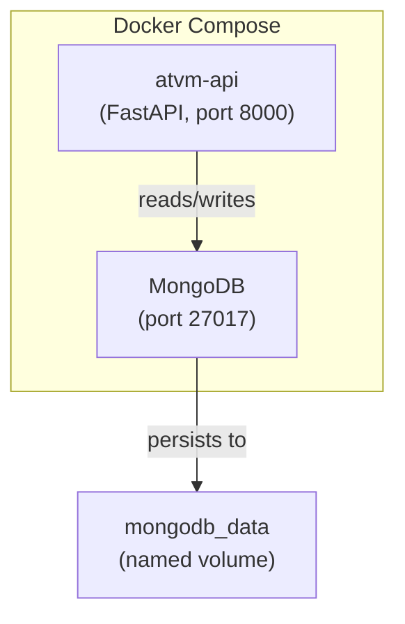

# ATVM — Automatic Ticket Vending Machine

## Executive Overview

ATVM is a **self-service ticket vending system** that runs on physical machines at transport hubs (bus stations, train stations, etc.). Passengers select tickets on a touchscreen, pay using one of several methods, and receive printed tickets — all without staff assistance.

---

## How It Works — Step by Step

### Step 1: The Passenger Selects Tickets

Each vending machine displays one or more **pages** on its touchscreen. Pages contain **tiles** — each tile represents a ticket type (e.g., "Adult Single", "Child Return", "Bicycle"). Tiles show prices, names in multiple languages (Danish, English, Swedish), and optional images.

### Step 2: The Passenger Pays

When the passenger presses "Pay", the system creates a **sale** and uses one of three payment methods:

| Payment Type | Use Case | How It Works |
|---|---|---|
| **selfpay** | Free tickets (children under 6, staff) | No external call. Tickets issued immediately. |
| **epay** | Online payments | Creates a payment session. Passenger scans a QR code or follows a link to pay on their phone. |
| **softpay** | Physical card payments | Activates the attached card terminal. Passenger taps or inserts their card. |

### Step 3: Payment Is Confirmed

After payment, the system checks the result by polling a validation endpoint:

The validation returns one of:
- **pending** — payment still in progress, keep waiting
- **ok** — payment succeeded, proceed to issue tickets
- **error** — payment failed, show error message
- **cancelled** — passenger cancelled

### Step 4: Tickets Are Issued

Once payment is confirmed as **ok**, a background **pipeline** takes over:

The pipeline calls the **Honnicloud ticketing API** to issue one digital ticket per purchased item. Each ticket gets a unique ID, validity dates, and a QR/barcode.

### Step 5: Sale Is Complete

After the pipeline finishes, the sale record is marked as complete and the frontend receives the full output payload.

---

## System Architecture

---

## Key Components

### 1. Configuration Management
Each machine has its own configuration — language, currency, payment provider credentials, and terminal IDs. This is managed through `/config/basesetup`.

### 2. Page & Tile Management
The touchscreen UI is built from **pages** containing **tiles**. Each tile represents a ticket type with pricing, multi-language labels, and optional images. Pages are configured per-machine through `/config/page`.

### 3. Sales & Payment
The core transaction flow:
1. Create a sale (`POST /sales`) with a payment method
2. Poll for payment status (`GET /sales_validation/{id}`)
3. When payment succeeds, the background pipeline issues tickets

### 4. Health Monitoring
The `/health` endpoint checks connectivity to all dependent services (MongoDB, Honnicloud API) and reports overall system health.

---

## Technology Stack

| Layer | Technology |
|---|---|
| **API Framework** | FastAPI (Python 3.11) |
| **Database** | MongoDB 7 (Motor async driver) |
| **Deployment** | Docker + Docker Compose |
| **Payment** | ePay (online) / Softpay (terminal) |
| **Ticketing** | Honnicloud API |
| **Package Manager** | uv |

---

## Deployment

Each vending machine runs a Docker Compose stack with two containers:

The API is stateless — all state lives in MongoDB. Machines are identified by unique machine IDs with Bearer token authentication.

---

## Multi-Machine Support

A single ATVM deployment can manage multiple machines, each with:
- Unique configuration (currency, language, payment provider)
- Custom page layouts and ticket offerings
- Separate transaction history

Machines communicate with the API over the local network or internet, authenticated by machine-specific keys.
