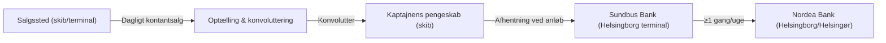
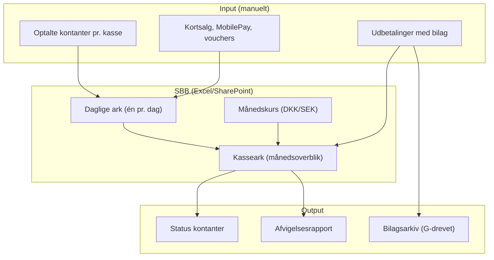
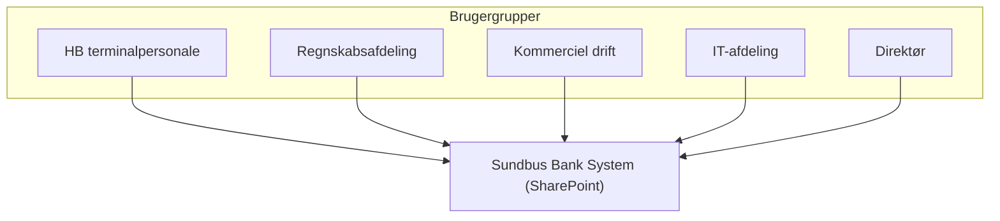

# Sundbus Bank System (SBB)
---

## Executive Overview: Sundbus Bank (intern kontantkasse)

### Formål & fysisk placering

*Sundbus Bank* er rederiets **centrale interne kontantkasse**. Den findes fysisk i **Helsingborg Terminalen** og administreres af terminalpersonalet. Kassen indeholder udelukkende kontanter (DKK/SEK) – ingen andre kasser (kaptajnskasse, køkkenkasse etc.) eksisterer. Alle daglige kontantsalg fra skibe og terminaler placeres i Sundbus Bank senest dagen efter salg.

### Daglig cash flow-proces

1. **Optælling på salgssted** – Ved dagens afslutning optælles kontanter. Fast kassebeholdning lægges tilbage, resten pakkes i konvolutter med angivelse af kasse, navn og beløb.
2. **Transport til skib** – Konvolutter fra skibe afleveres til kaptajnen (skibets pengeskab). Konvolutter fra Helsingør terminal placeres i skab; kaptajnen henter dem ved næste anløb i Helsingborg.
3. **Afhentning på land** – Personalet i Helsingborg henter konvolutter fra skibene ved første anløb (eller inden afgang, hvis skib ligger kaj).
4. **Indsætning i bank** – Mindst én gang ugentligt pakkes kontanter fra Sundbus Bank og indsættes i **Nordea Bank** (Helsingborg og Helsingør).

### Administrationssystem (Sundbus Bank System – SBB)

SBB er et **Excel-baseret system** hostet i **SharePoint Online** (Microsoft 365). Det giver **samtidig adgang** for flere brugere (ingen versionskonflikter).

**Adgangskontrol** (begrænset til):
- HB terminalpersonale
- Regnskabsafdeling
- Kommerciel daglig drift
- IT-afdeling
- Direktør

**Systemstruktur**:
- Én **mappe** pr. måned med et samleark (`KASSE`) og individuelle ark pr. dag.
- **Gule felter** = redigerbare; alle øvrige låst.
- Daglige ark indeholder rækker per kasse (Pernille, Jeppe, Lea Elizabeth). Automatisk opdatering kl. 23:55.
- **Kasseark** indeholder:
  - Månedskurs (DKK/SEK) – fastsat pr. måned, ændres kun centralt ved månedsskifte.
  - Status over kontanter i Sundbus Bank (primo, indsat, udtaget).
  - Dataoverførsel fra daglige ark (optalte beløb).
  - Registrering af udbetalinger med bilagskrav.

**Bilagshåndtering**:
- Alle udbetalinger kræver bilag (scannes, gemmes på G-drevet: `12-BILAG til dagsrapporter`). Navngivning: `SBB ÅÅMMDD`.
- Aconto-udbetalinger: registreres med standardbilag; ved retur føres negativ linje + faktisk indkøbsbilag.

### Kontrol & risici

- **Løbende kontrol** udføres af regnskabsafdelingen (afstemning mellem SBB og fysiske beholdninger).
- **Stikprøvekontrol** af kassernes faste beholdninger kan foretages.
- **Væsentlig risiko**: Kursændringer midt i måneden kan ske, men kræver administratorindgreb – ellers opdateres kursen ikke i daglige ark.
- **Ingen automatisk integration** til Economics eller Shopbox – data tastes manuelt.

---

## Mermaid-diagrammer (GitHub-kompatibel)

### 1. Pengeflow – fra salgssted til Nordea

### 2. Dataflow i Sundbus Bank System (SBB)

### 3. Roller og adgang – SBB

