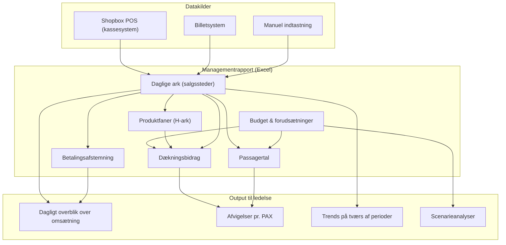
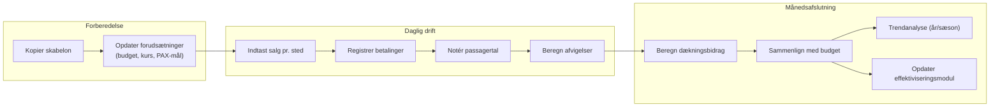
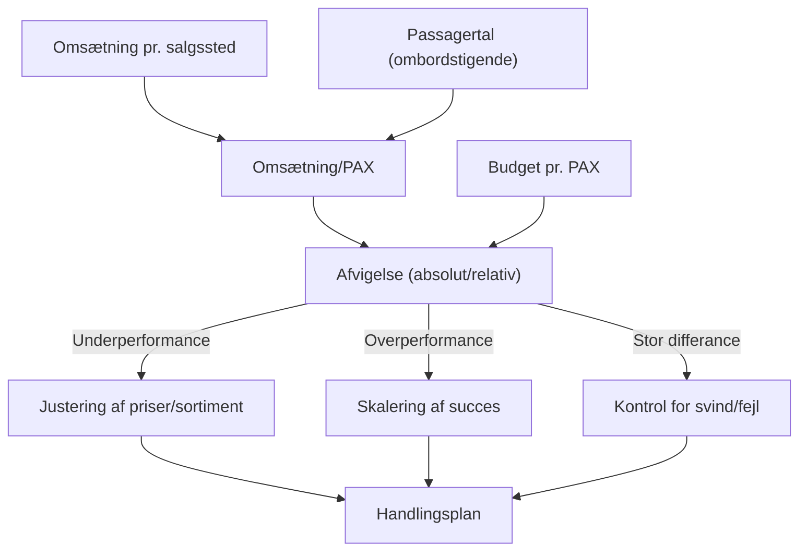

---

## Managementrapport – Kommerciel Driftsopfølgning (Helsingør–Helsingborg-ruten)

### Executive Overview

Managementrapporten er rederiets **centrale kommercielle styringsværktøj**. Den samler daglige data fra alle salgssteder (barer, køkken, shop, billetter) og kobler dem med passagertal, budgetter og dækningsbidrag. Rapporten giver ledelsen et **aktuelt, handlingsorienteret overblik** over performance, så afvigelser kan adresseres hurtigt – og beslutninger om priser, sortiment og bemanding træffes datadrevent.

Rapporten er Excel-baseret med en fast struktur pr. måned, genbrugelig skabelon og understøttelse af scenarieplanlægning.

### Hovedfunktioner

| Funktion | Beskrivelse |
|----------|-------------|
| **Daglig salgsregistrering** | Omsætning pr. salgssted (Øvre bar, Forbar, Shop, Nedre bar, Solbar, Extra bar) fordelt på billetter, køkken, bar, tobak, slik, shopvarer, diverse, bingo. Data manuel eller importeret. |
| **Produktspecifik detaljering** | Underliggende faner (”H-ark”) nedbryder kategorier til enkeltprodukter (fadøl, cider, drinks, kaffe, cigaretter, spiritus, vin, slikvarianter) pr. salgssted. Understøtter marginstyring og sortimentsoptimering. |
| **Betalingsafstemning** | Daglige skemaer for kontanter (DKK/SEK), kort, MobilePay, vouchers, fakturaer. Automatisk differanceberegning mod salgstal. Sikrer kontrol, svindminimering og regnskabsdokumentation. |
| **Passagertal & kapacitet** | Registrering af ombordstigende og viderefarende passagerer pr. dag, sammenholdt med budget. Giver indsigt i rutebelastning. |
| **Budgetopfølgning pr. passager (PAX)** | Omsætning omregnes til nøgletal pr. PAX og holdes op mod budget. Afvigelser vises absolut og relativt. |
| **Dækningsbidrag & lønsomhed** | Månedsberegning af bruttodækningsbidrag (DG) pr. salgskonto og produktgruppe. Identificerer rentable indtægtsstrømme. |
| **Forudsætninger & scenarieplanlægning** | Et forudsætningsark fastsætter budgetterede passagertal, valutakurs (SEK/DKK) og omsætningsmål. Skabelonen kopieres til nye måneder; ”hvad nu hvis”-scenarier testes. |
| **Periodesammenligning** | Fast struktur muliggør direkte sammenligning af samme måned på tværs af år samt sæsonudvikling. Understøtter trendanalyse og strategisk planlægning. |
| **Effektiviseringsmodul (”Rest”)** | Tracker igangværende forbedringsinitiativer: automatisering af kontanthåndtering (Sundbus Bank), digitalisering af toldbog, lager-/indkøbssystemer, datavarehusintegration, infrastrukturprojekter. Estimerer tidsbesparelser og omkostningseffekter. |

### Overordnet værdiskabelse

Rapporten fungerer som ét **samlet kommercielt cockpit**. Den sikrer, at ledelsen dagligt kan følge omsætning, passagerflow, bidrag pr. passager, afvigelser og svind – i en struktureret, genbrugelig Excel-ramme med minimal månedlig opsætning.

---

## Mermaid-diagrammer (GitHub-kompatibel)

### 1. Datastrømme i managementrapporten

### 2. Rapports struktur – månedligt workflow

### 3. Nøgletal og afvigelser – fra data til handling

---

