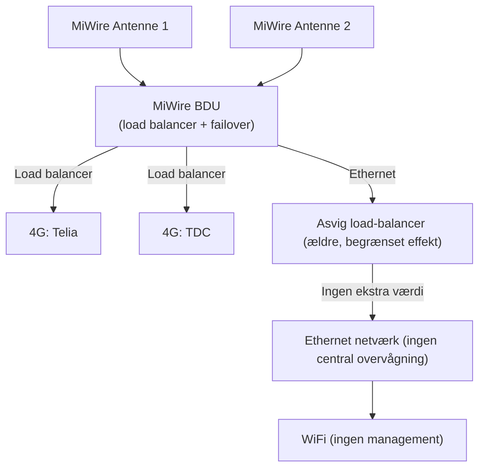
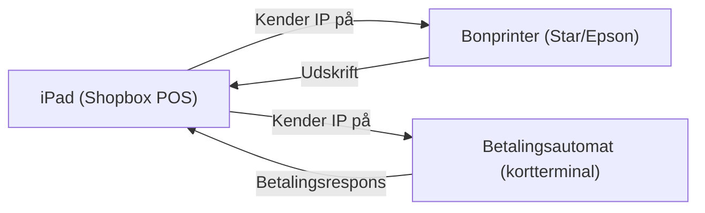
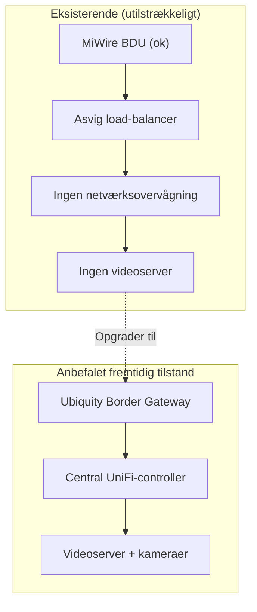
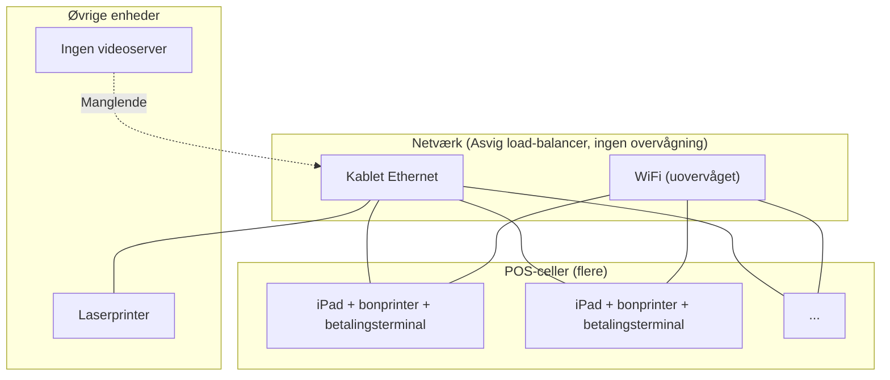

---
## Executive Overview: Infrastruktur på M/S Pernille

### Netværks- & connectivitylag

*Pernille* anvender samme **MiWire-antenneopsætning** som *Jeppe*: to uafhængige antenner, der fødes ind i en **MiWire BDU (Below Deck Unit)** med load balancing mellem Telia og TDC 4G.  

**Dog** er BDU’ens Ethernet-udgang ikke tilsluttet en moderne Ubiquity Border Gateway, men derimod en **ældre, Asvig-udviklet load-balancer**. Denne enhed har i praksis **begrænset effekt**, fordi MiWire-setuppet allerede håndterer operator-failover. Den Asvig-udviklede enhed tilfører ingen yderligere redundans eller optimering.

### 1. Nuværende netværksarkitektur – Pernille (mangelfuld)

**Konsekvenser:**
- **Ingen central netværksovervågning** – hverken over WiFi-adgangspunkter, kablede porte eller enhedsstatus.
- **Ingen mulighed for moderne netværksmanagement** (f.eks. UniFi-controller eller tilsvarende).
- Ældre komponenter giver generelt lavere stabilitet og sværere fejlsøgning.

### POS- & betalingsinfrastruktur

Kassestationerne (cellerne) er **identiske** med *Jeppe*: hver celle består af en iPad (Shopbox), en bonprinter (Star/Epson) og en betalingsautomat, der kommunikerer via kendte IP-adresser inden for cellen.

### 2. POS-celle

### Videoovervågning

**Ingen videoserver om bord.** *Pernille* har i dag **ingen ISPS-videoovervågning** – hvilket er et bemærket sikkerhedsmæssigt gab.

### Øvrige enheder

- En laserprinter til kontorfunktioner (antages at være tilsluttet det eksisterende netværk).

### Samlet vurdering & anbefaling

Infrastrukturen på *Pernille* er **betydeligt ældre** end på *Jeppe* og lider under:
- Forældet og ineffektiv load-balancer
- Ingen central netværksovervågning
- Ingen videoovervågning

**Anbefaling:** Et **fuldt overhaul** af netværksinfrastrukturen anbefales. Dette bør inkludere:
1. Udskiftning af den Asvig-udviklede load-balancer med en moderne **Ubiquity Border Gateway** (eller tilsvarende).
2. Implementering af **central netværksovervågning** (f.eks. UniFi-controller).
3. Etablering af **videoovervågning (videoserver + kameraer)** i overensstemmelse med ISPS-krav.
4. Eventuel opgradering af kabling og WiFi-access points.

---

### 3. Mangler og flaskehalse – visuel oversigt

### 4. Samlet enhedsoversigt på Pernille (nuværende)

